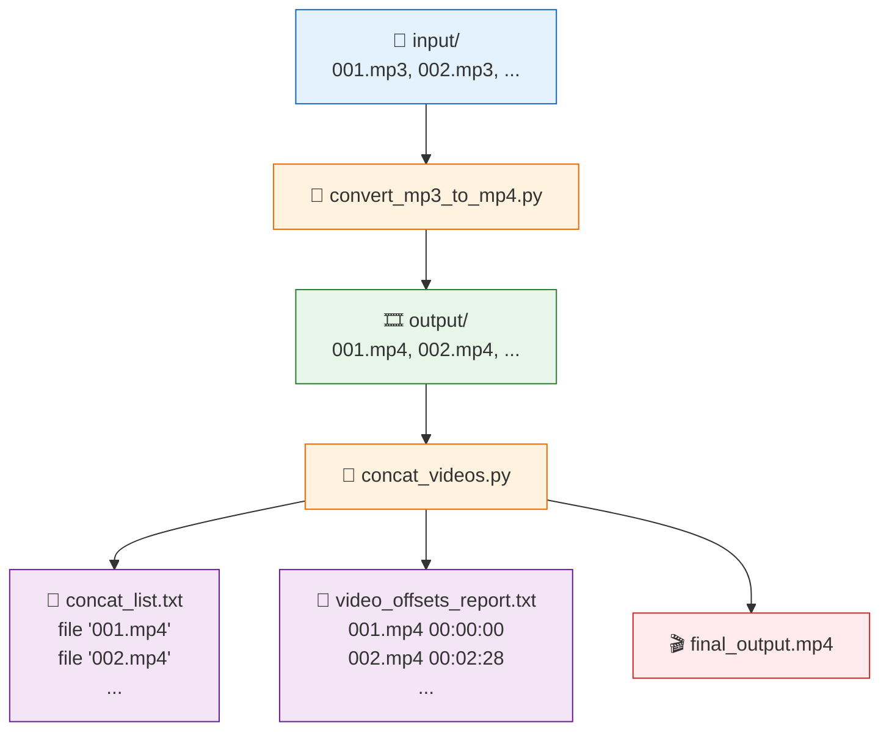

# 🎬 aud2vid
A lightweight and automation-friendly pipeline for converting **audio → video** and concatenating multiple MP4 files into one final output.  
Built using Python + FFmpeg.

This project automates:

✔ Batch MP3 → MP4 conversion (with a generated black video background)  
✔ Extracting video durations via `ffprobe`  
✔ Computing cumulative start time offsets  
✔ Generating `concat_list.txt` for FFmpeg  
✔ Concatenating all MP4s into a final output video  
✔ Producing a clean offsets/timecode report for all segments  

Ideal for podcast compilation, audio archiving, automated media pipelines, and batch processing.

---

## Procedure



---

## 📂 Directory Structure

```

aud2vid/
│
├── input/          # Place source MP3s or MP4s here
├── output/         # Converted MP4s + final_output.mp4 appear here
│
├── convert_mp3_to_mp4.py
├── concat_videos.py
│
├── requirements.txt
└── README.md

````

---

## ⚙️ Installation

### 1. Install FFmpeg (required)
macOS:
```bash
brew install ffmpeg
````

Ubuntu:

```bash
sudo apt install ffmpeg
```

### 2. Install Python dependencies

```bash
pip install -r requirements.txt
```

---

## 🎧 Convert MP3 → MP4 (Black Video Background)

Place `.mp3` files inside:

```
aud2vid/input/
```

Run:

```bash
python3 convert_mp3_to_mp4.py
```

Each MP3 will generate a corresponding MP4:

```
aud2vid/output/001.mp4
aud2vid/output/002.mp4
...
```

### What this script does:

* Creates a **1080p black video background** using FFmpeg's `color` filter
* Combines audio + generated video
* Outputs clean H.264/AAC MP4 files

---

## 🎬 Concatenate All MP4 Files

After converting or placing MP4s into:

```
aud2vid/output/
```

Run:

```bash
python3 concat_videos.py
```

The script will:

* Detect `.mp4` files (sorted automatically)
* Extract duration using `ffprobe`
* Compute cumulative time offsets
* Create:

```
output/concat_list.txt
output/final_output.mp4
output/video_offsets_report.txt
```

### Example Offsets

```
001.mp4 → 00:00:00
002.mp4 → 00:02:28
003.mp4 → 00:05:09
...
```

---

## 🧪 Example Full Workflow

```
input/
  001.mp3
  002.mp3
  003.mp3

Run convert_mp3_to_mp4.py:
  → output/001.mp4
  → output/002.mp4
  → output/003.mp4

Run concat_videos.py:
  → output/final_output.mp4
  → output/video_offsets_report.txt
```

---

## 🚀 Advanced Enhancements (Optional)

These can be added anytime:

* ✔ Replace black background with an image
* ✔ Add waveform visualization
* ✔ Add subtitles or chapter markers
* ✔ Auto-reencode mismatched MP4s
* ✔ Dockerfile for fully reproducible builds
* ✔ Makefile (`make convert`, `make concat`)

Ask and I’ll generate any of these.

---

## 🛠 Troubleshooting

### ❌ FFmpeg error: `Error opening input file color=black:s=1920x1080`

The correct usage is:

```
ffmpeg -f lavfi -i color=black:s=1920x1080 ...
```

Already fixed in this repository’s scripts.

### ❌ Output video has no audio

Ensure your MP3 files aren’t corrupted; re-run the conversion step.

### ❌ `final_output.mp4` glitches

Use re-encode mode instead of `-c copy` (I can generate this version).

---

## 📜 License

MIT License — free to use, modify, and distribute.

---

## 🧑‍💻 Author

atx0mg

---

## ⭐ Contributing

Pull requests, improvements, and feature requests are welcome!
